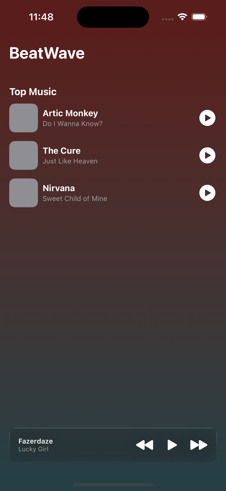

# BeatWave

BeatWave is an app that plays songs from bundled `.mp3` files, from URLs and displays them on the screen if the login is successful.

To test the app simply clone the repo and run it.
To get back to the initial flow after performing log in for the first time, you can remove the entry for the key `KeychainCredentialStore.key` or simply update this key on the codebase to a different value and re-launch the app.

> MVVM is used as the guiding design pattern, with adaptations to support SwiftUI.

### AC 1
On app start, a login screen is presented, showing a two text fields, one for username and another one for the password.

### AC 2
Upon enterind the login (no validation for now) the app navigates to a home screen with the songs displayed.

## Login Feature

### Data (Input):

-  Username (String)
-  Password (String)

### Primary course (happy path):

1.  Execute Login operation by supplying a non-empty username and password. There's no validation at this point.
2.  System persists credentials on Keychain for 7 days.
3.  System deletes credentials after 7 days on app launch.

### Video Recording
https://github.com/viniciusml/BeatWave/blob/main/screenshots/recording.mp4

